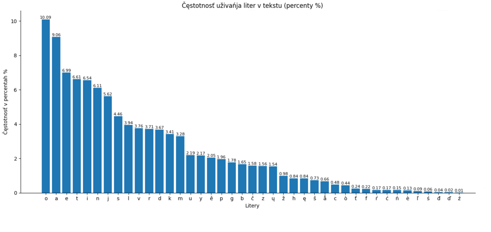
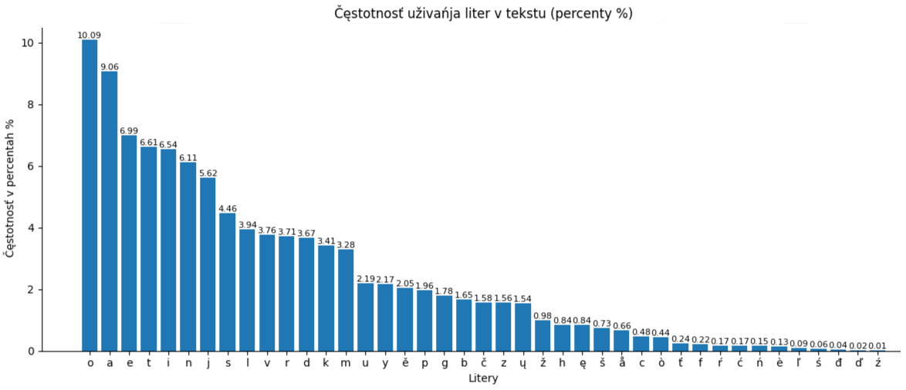

Kake bukvy sut najvyše važne pri učenju pravopisa i izgovora? Kake potrěbujemo dodati v centr pri tvorjenju, napriměr, dizajna klaviatury? Jest li standardny alfabet medžuslovjanskogo dostatočny, ili něktore etimologične litery takože budut dobre? Na to pytanje nam pomože odgovoriti statistika upotrěbjenja medžuslovjanskyh liter, i na ščestje sdělati ju sovsim ne jest težko.

## Etap 1, sbiranje tekstov

Jestvuje ne tako mnogo velikyh i kvalitetnyh tekstov na etimologičnom pravopisu, zato rabota ne bude težka. Ja jesm rěšil vzeti povědku Melaca *"Nehaj nesut nas běle oblaky"* (ješče ne je publična, tutčas jest na etapu zapisyvanja audio-knigy), medžuslovjansky [Turističny fraznik](https://docs.google.com/spreadsheets/d/1YvdNWgGD6ql00AF884ak9xCXPy-W1VbcCNO_6prdg9g/edit?usp=sharing) i moje prěvody fraz iz Rosetta Stone. Trěba bylo sjedinjiti teksty, nemnogo očistiti jih, i... Gotovo, dane sut [sobrane](https://app.box.com/s/dmur0do5deef6mfiwzsdpnl91o11r5xi.). 

Budemo položiti fajl v folder s programoju i pročitati jego:

```python
with open("isv.txt", 'r', encoding ="UTF-8") as file:
	text = file.read()
	text = file.lower() #transformujemo vse velike bukvy v male
	text = [char for char in text if char.isalpha()] #ostavjajemo v tekstu jedino bukvy, bez čisel i punktuacije
```

Nakoliko on jest veliky, ktore bukvy imaje?

```python
>>> len(text) 
598670 #Bez malogo 600 tyseč liter, ne jest slabo! 

>>> from collections import Counter
>>> Counter(text)                                     
Counter({'o': 39018, 'a': 33567, 'e': 24658, 'i': 24222, 't': 23769, 'n': 22895, 'j': 19676, 's': 16008, 'l': 14938, 'v': 13870, 'r': 13856, 'd': 13772, 'k': 12619, 'm': 11552, 'ě': 7848, 'y': 7796, 'u': 7649, 'p': 7071, 'g': 6781, 'b': 6233, 'č': 6000, 'z': 5938, 'ų': 5150, 'ž': 3493, 'h': 3394, 'ę': 2906, 'š': 2681, 'å': 2508, 'c': 1688, 'ò': 1679, 'f': 786, 'ť': 682, 'ŕ': 671, 'ń': 665, 'ć': 588, 'è': 559, 'ľ': 324, 'ś': 243, 'đ': 147, 'ď': 77, 'ā': 72, 'ź': 69, 'ŭ': 27, 'ī': 25, 'æ': 10, 'ē': 8, 'w': 7, 'ъ': 7, 'ŋ': 7, 'ь': 6, 'ó': 5, 'ą': 4, 'о': 2, 'ḱ': 2, 'ȯ': 2, 'ň': 1, 'ј': 1, 'а': 1})
```

V rezultatu vidimo něktore artefakty, kako napriměr egzotične bukvy jezyka Oblěčennyh Dolin iz povědky *"Nehaj nesut nas běle oblaky"*. Ili kiriličnu А ili češsku Ň v medžuslovjanskom tekstu. A čto dělaje medžuslovjanin, kogda vidi grěšku? Samorazumno, on ide pisati do avtora knigy. 


Okej, jesmo sdělali dobro dělo i tutčas jest vrěme vratiti se do raboty.


# Tvojrenje analizy

Za tvorjenje diagrama budemo upotrěbiti popularnu biblioteku [Matplotlib](https://pypi.org/project/matplotlib/) (Ili Plotly/Seaborn sut lěpje? Čto myslite?)

```python
import matplotlib.pyplot as plt 
from collections import Counter
```

Ja jesm dozvolil sobě malu volnost, tuta analiza bude koristati stary variant (do 2019 goda) variant etimologičnogo pravopisa. To jest od togo povoda zatože upotrěbjenje liter *t́d́ĺėȯ* zaměsto *ťďľèò* dělaje cěly spis tehničnyh problemov, a večša čest tekstov iz fajla imajut stary variant ortografije.

Itak:

```python
#dělajemo spis vseh medžuslovjanskyh liter
isv_letters = 'o a e t i n j s l v r d k m u y ě p g b č z ų ž h ę š å c f ŕ ć ń è ė ȯ ò ś đ ź t́ ť d́ ď ĺ ľ ј'.split(' ')
# i filtrujemo, da by v tekstu byli jedino one
text = [char for char in text if (char in isv_letters)]

#čislimo, koliko liter imaje tekst, a potom dělajemo sortovanje spisa
frequencies = Counter(text)
frequencies = sorted(frequencies.items(), key=lambda x: x[1], reverse=True)

#razděljajemo naš rezultat na oddělne spisy, a čestotnost bukv (counts) prěvodimo v percenty
letters = [ i[0] for i in frequencies ]
counts = [ i[1] for i in frequencies ]
counts = [ i / sum(counts)*100 for i in counts]
```


Dalje budemo sbudovati diagramu črěz Matplotlib i dodati anotacije

```python
plt.bar(letters, counts)
plt.xlabel('Litery')
plt.ylabel('Čęstotnosť v percentah %')
plt.title('Čęstotnosť uživańja liter v tekstu (percenty %)')

for i, (count) in enumerate(counts):
	plt.annotate(f"{ round(count, 2) }", (i, count), ha='center', va='bottom', fontsize=8)
        
plt.show() 
```


Budemo izpolniti toj kod dva raza, za polny, etimologičny alfabet medžuslovjanskogo, i za variant, ktory jest transliterovany do standardnogo alfabeta (imam oddělnu biblioteku za toj cěl)

Itak, statistika za etimologičny:



I za standardny alfabet:



Možemo tut viděti věči, o ktoryh mnogi ljudi myslili i ranje. Tak, *Yy* i *Ěě* sut najmenje važne iz standardnyh suglasok, i zaisto imamo projekty, ktore jih ignorujut. *Ęę*, *Ųų* i *Åå* sut najvyše česte etimologične bukvy, i rekomendacija učiti se jim jesvovala i ranje. 

Imamo takože autsajdera, *Đđ* ne jest ni često uživana, ni važna za grammatiku kako mekke zvuky *ťŕćńľśďź*. 


