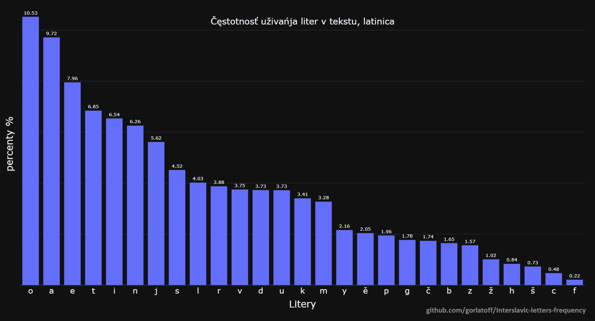
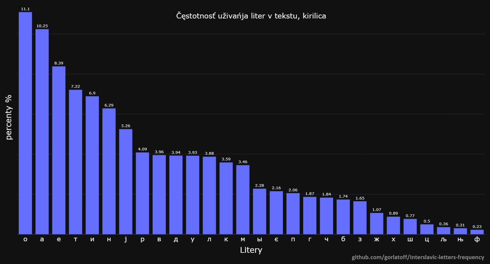

Kake bukvy sut najvyše važne pri učenju pravopisa i izgovora? Kake potrěbujut byti centralnymi pri tvorjenju, napriměr, dizajna klaviatury? Jest li standardny alfabet medžuslovjanskogo dostatočny, ili něktore etimologične litery takože budut dobre? Na to pytanje nam pomože odgovoriti statistika upotrěbjenja medžuslovjanskyh liter, i, na ščestje, sdělati ju sovsim ne jest težko.

## Etap 1, sbiranje tekstov

Jestvuje ne tako mnogo velikyh i kvalitetnyh tekstov na etimologičnom pravopisu, zato rabota ne bude težka. Ja jesm rěšil vzeti povědku Melaca *"Nehaj nesut nas běle oblaky"* (ješče ne je publična, tutčas jest na etapu zapisyvanja audio-knigy), medžuslovjansky [Turističny fraznik](https://docs.google.com/spreadsheets/d/1YvdNWgGD6ql00AF884ak9xCXPy-W1VbcCNO_6prdg9g/edit?usp=sharing) i moje prěvody fraz iz Rosetta Stone. Trěba bylo sjediniti teksty, nemnogo očistiti jih, i... Gotovo, dane sut [sobrane](https://github.com/gorlatoff/Interslavic-letters-frequency/blob/main/isv.txt). 

Položimo fajl v folder s programom i pročitajemo jego:

```python
with open("isv.txt", 'r', encoding ="UTF-8") as file:
	text = file.read()
	text = file.lower() #transformujemo vse velike bukvy v male
```

Nakoliko on jest veliky, ktore bukvy imaje?

```python
>>> text = [char for char in text if char.isalpha()] #ostavjajemo v tekstu jedino bukvy, bez čisel i punktuacije
>>> len(text) 
470285 #Priblizno polovina miliona liter, ne jest tako slabo! 

>>> from collections import Counter
>>> Counter(text)                                     
Counter({'o': 39018, 'a': 33567, 'e': 24658, 'i': 24222, 't': 23769, 'n': 22895, 'j': 19676, 's': 16008, 'l': 14938, 'v': 13870, 'r': 13856, 'd': 13772, 'k': 12619, 'm': 11552, 'ě': 7848, 'y': 7796, 'u': 7649, 'p': 7071, 'g': 6781, 'b': 6233, 'č': 6000, 'z': 5938, 'ų': 5150, 'ž': 3493, 'h': 3394, 'ę': 2906, 'š': 2681, 'å': 2508, 'c': 1688, 'ò': 1679, 'f': 786, 'ť': 682, 'ŕ': 671, 'ń': 665, 'ć': 588, 'è': 559, 'ľ': 324, 'ś': 243, 'đ': 147, 'ď': 77, 'ā': 72, 'ź': 69, 'ŭ': 27, 'ī': 25, 'æ': 10, 'ē': 8, 'w': 7, 'ъ': 7, 'ŋ': 7, 'ь': 6, 'ó': 5, 'ą': 4, 'о': 2, 'ḱ': 2, 'ȯ': 2, 'ň': 1, 'ј': 1, 'а': 1})
```

V rezultatu vidimo něktore artefakty, kako napriměr egzotične bukvy jezyka Oblěčenyh Dolin iz povědky *"Nehaj nesut nas běle oblaky"*. Ili kiriličnu А i češsku Ň v medžuslovjanskom tekstu. A čto dělaje medžuslovjanin, kogda vidi grěšku? Samorazumno, on ide pisati avtoru knigy. 


Okej, jesmo sdělali dobro dělo i tutčas jest vrěme vratiti se do raboty.


# Tvorjenje analizy

Za tvorjenje diagrama upotrěbimo popularnu biblioteku [Plotly](https://plotly.com/graphing-libraries/) (prva versija članka uživala Matplotlib, ale praktika je pokazala, že on ne dozvaljaje radikalno izměnjenje razměrov diagrama).

```python
import plotly.graph_objects as go
from collections import Counter
```

Ja jesm dozvolil sobě malu volnost, tuta analiza bude koristati stary (do 2019 goda) variant etimologičnogo pravopisa. To jest od togo povoda zatože upotrěbjenje liter *t́d́ĺėȯ* zaměsto *ťďľèò* dělaje cěly spis tehničnyh problemov, a večša čest tekstov iz fajla imaje stary variant ortografije.

Itak:

```python
#tvorimo spis vsih medžuslovjanskyh liter
isv_letters = 'o a e t i n j s l v r d k m u y ě p g b č z ų ž h ę š å c f ŕ ć ń è ė ȯ ò ś đ ź t́ ť d́ ď ĺ ľ ј'.split(' ')
# i filtrujemo, da by v tekstu byli jedino one
text = [char for char in text if (char in isv_letters)]

#čislimo, koliko liter imaje tekst, a potom dělajemo sortovanje spisa
frequencies = Counter(text)
frequencies = sorted(frequencies.items(), key=lambda x: x[1], reverse=True)

#razděljajemo naš rezultat na oddělne spisy, a čestotnost bukv (counts) prěvodimo v percenty
letters = [ i[0] for i in frequencies ]
counts = [ i[1] for i in frequencies ]
counts = [ i / sum(counts)*100 for i in counts]
```


Dalje budemo sbudovati diagram i dodati anotacije

```python
fig = go.Figure(go.Bar(
    x = letters,
    y = counts,
    text = [f"{round(count, 2)}" for count in counts], #anotacije
    textposition = 'outside',
))

fig.update_layout(
    title = dict(text = title, font = dict(size = 18), x = 0.5, y = 0.85, xref="paper"),
    yaxis_title = 'percenty %',
    xaxis_title = 'Litery',
)
    
fig.show()
```


Budemo izpolniti toj kod tri razy, za etimologičny alfabet medžuslovjanskogo, i za varianty, ktore sut transliterovane do standardnyh latinice i kirilice (imam oddělnu biblioteku za toj cělj)

Itak, statistika za etimologičny:


I za standardny latiničny alfabet:




<details>
  <summary>Transliteracija do standardnyh kirilice i latinice ne je složena. To jest uproščeny priměr, ktory ne uměje rabotati s VELIKYMI bukvami</summary>

```python
trans_tables = { 'isv_to_standard': 'ć-č ć-č ć-č ś-s ź-z ŕ-r ĺ-l ľ-l ń-n t́-t ť-t d́-d ď-d đ-dž ò-o ȯ-o ė-e è-e č-č š-š ž-ž ě-ě е̌-ě å-a ę-e ų-u',
                 'isv_to_cyrillic': 'ń-н ľ-л nj-њ lj-љ ć-ч ć-ч ć-ч ś-с ź-з ŕ-р t́-т ť-т d́-д ď-д đ-дж ò-о ȯ-о ė-е è-е č-ч š-ш ž-ж ě-є е̌-є ě-є å-а ę-е ų-у a-а b-б c-ц č-ч d-д e-е f-ф g-г h-х i-и j-ј k-к l-л m-м n-н o-о p-п r-р s-с š-ш t-т u-у v-в y-ы z-з ž-ж',
}

def transliteracija(text, lang):
    if lang not in trans_tables.keys():
        return text
    for i in trans_tables[lang].split(' '):
        letters = i.split('-')
        print(f"'{letters[0]}' - '{letters[1]}'")
        text = text.replace(letters[0], letters[1])
    return text

text_standard_lat = transliteracija(text, "isv_to_standard")
text_standard_cyr = transliteracija(text, 'isv_to_cyrillic')
```
</details>


Možemo tut viděti věči, o ktoryh mnogi ljudi sut myslili i ranje. Tak, *Yy* i *Ěě* sut najmenje važne iz standardnyh samoglasok, i zaisto imamo alternativne projekty, ktore jih ignorujut. *Ęę*, *Ųų* i *Åå* sut najvyše česte etimologične bukvy, i rekomendacija učiti se jim jesvovala i ranje. 

Imamo takože autsajdera, *Đđ* ne jest ni često uživana, ni važna za grammatiku (kako mekke zvuky *ŕćńśźťďľ*  ).

Takože, budemo pogleděti na kirilicu i čestotnost kiriličnyh bukv њ i љ. Rezultat jest prědvidimy, tute bukvy zajedno imajut jedino 0.67% od srědnogo teksta na kirilici. Ne jest divno že ljudi regularno dělajut s njimi grěšky.



<details>
  <summary>Polny kod možete uviděti tut:</summary>

```python
import plotly.graph_objects as go
from collections import Counter

isv_letters_lat = 'o a e t i n j s l v r d k m u y ě p g b č z ų ž h ę š å c f ŕ ć ń è ė ȯ ò ś đ ź t́ ť d́ ď ĺ ľ ј'.split(' ')
isv_letters_cyr = 'о а е т и н ј c л в р д к м у ы є п г б ч з ж х ц ф ш њ љ'.split(' ')

#to jest prosto nastavjenje temnoj temy
import plotly.io as pio
pio.templates.default = "plotly_dark"


def count_letters_frequency(text, alphabet, title):
    text = [char for char in text if (char in alphabet)]
    frequencies = Counter(text)
    frequencies = sorted(frequencies.items(), key=lambda x: x[1], reverse=True)

    letters = [ i[0] for i in frequencies ]
    counts = [ i[1] for i in frequencies ]
    counts = [ i / sum(counts) * 100 for i in counts]

	fig = go.Figure(go.Bar(
        x=letters,
        y=counts,
        text=[f"{round(count, 2)}" for count in counts], #anotacije
        textposition='outside',
    ))

    fig.update_layout(
        title=dict(text=title, font=dict(size=18), x=0.5, y=0.85, xref="paper"),
        yaxis_title='percenty %',
        xaxis_title='Litery',
    )

    fig.show()


with open("isv.txt", 'r', encoding="UTF-8") as file:
    text = file.read()
    text = text.lower()

import isv_tools as isv 
text_standard_lat = isv.transliteracija(text, "isv_to_standard")
text_standard_cyr = isv.transliteracija(text, 'isv_to_cyrillic')

count_letters_frequency(text, isv_letters_lat, 'Čęstotnosť uživańja liter v tekstu, etimologičny alfabet')
count_letters_frequency(text_standard_lat, isv_letters_lat, 'Čęstotnosť uživańja liter v tekstu, latinica')
count_letters_frequency(text_standard_cyr, isv_letters_cyr, 'Čęstotnosť uživańja liter v tekstu, kirilica')


```
</details>

Htěl byh povtoriti tu rabotu za druge slovjanske jezyky, zatože ne jesm smogl najdti statistiku za vsaky jezyk. Či někto znaje male ale mnogojezyčne datasety, ktore sut dobre za toj cělj? Ako li imajete komentary, prosim učestvovati v diskusiji v našem [Telegramu.](https://t.me/interslavicthings/399)


I bonus, poprosimo ChatGPT sdělati několiko modifikacij v kodu, i najdemo medžuslovjanske bigramy:

```python
from collections import Counter

with open("isv.txt", 'r', encoding="UTF-8") as file:
    text = file.read()
    text = text.lower()

from nltk import ngrams
frequencies = ngrams(text, 2)
frequencies = [''.join(ngram) for ngram in frequencies]
frequencies = [ngram for ngram in frequencies if ngram.isalpha()]
frequencies = Counter(frequencies)
```

<details>
  <summary>Rezultat:</summary>

```python
>>> pprint.pprint(frequencies)
Counter({'je': 14553, #jotovana E
         'na': 7867,
         'to': 6751,
         'st': 6393,
         'aj': 5781,
         'ko': 5482,
         'on': 5279,
         'no': 5107,
         'es': 4376,
         'ti': 4007, # Razumlivo, odkud to jest
         'ne': 3863, # Velmi razumlivy bigram xD
         'li': 3774, # i tute
         'da': 3614, # takože
         'ta': 3611,
         'po': 3446,
         'om': 3347,
         'go': 3332,
         'ja': 3291, # Jotovana A
         'la': 3271,
         'ov': 3229,
         'al': 3213,
         'ka': 3157,
         'ra': 3048,
         'ak': 3018,
         'tu': 2932,
         'oj': 2923,
         'ri': 2901,
         'mo': 2865,
         'or': 2843,
         'va': 2805,
         'ut': 2762,
         'vo': 2630,
         'pr': 2560,
         'in': 2474,
         'lo': 2408,
         'og': 2395,
         'od': 2350,
         'do': 2347,
         'ro': 2325,
         'že': 2287,
         'os': 2258,
         'ni': 2228,
         'jų': 2205,
         'en': 2204,
         'tr': 2122,
         'za': 2059,
         'ma': 2049,
         'rå': 2013,
         'at': 1982,
         'sę': 1898,
         'ųt': 1855,
         'sl': 1807,
         'av': 1788,
         'it': 1766,
         'di': 1759,
         'ob': 1747,
         'rě': 1707,
         'by': 1705,
         'ny': 1695,
         'iz': 1645,
         'am': 1621,
         'lj': 1619, # Digrafy LJ i NJ sut veliko rědke, hot one oficialno jest čest alfabeta 
         'te': 1596,
         'ik': 1554,
         'ně': 1524,
         'mi': 1491,
         'gl': 1465,
         'im': 1464,
         'či': 1460,
         'vi': 1445,
         'as': 1401,
         'čt': 1394,
         'kr': 1384,
         'nj': 1375, # NJ
         'dě': 1368,
         'el': 1336,
         'ěl': 1329,
         'ol': 1323,
         'ča': 1317,
         'de': 1286,
         'če': 1286,
         'le': 1278,
         'il': 1274,
         'ož': 1244,
         'ty': 1219,
         'dn': 1216,
         'vě': 1209,
         'ed': 1204,
         've': 1202,
         'ji': 1198,
         'em': 1192,
         'an': 1150,
         'ot': 1150,
         'sk': 1145,
         'vy': 1143,
         'kt': 1135,
         'ho': 1133,
         'ij': 1129,
         'lå': 1089,
         'ad': 1084,
         'lě': 1075,
         'si': 1074,
         'me': 1073,
         'ky': 1048,
         'sm': 1029,
         'iv': 1027,
         'ěk': 1012,
         'id': 1010,
         'ah': 989,
         'ar': 986,
         'ět': 963,
         'ej': 961,
         'mě': 960,
         'bo': 911,
         'sv': 911,
         'ry': 900,
         'mn': 895,
         'eg': 874,
         'sų': 831,
         'zn': 820,
         'pa': 817,
         'my': 802,
         'aš': 802,
         'is': 796,
         'br': 793,
         'ok': 781,
         'åz': 767,
         'ěv': 767,
         'ju': 758, # Jotovana U jest rědka
         'gd': 757,
         'ir': 756,
         'se': 752,
         'et': 751,
         'rj': 732,
         'dr': 731,
         'òg': 722,
         'ěd': 719,
         'gr': 718,
         'še': 695,
         'ič': 695,
         'bl': 682,
         'ųd': 681,
         'bě': 678,
         'uj': 676,
         'ži': 675,
         'ru': 673,
         'er': 665,
         'ěč': 661,
         'ńj': 657,
         'ev': 656,
         'nų': 652,
         'ęt': 646,
         'vn': 641,
         'nt': 634,
         'lę': 631,
         'ys': 626,
         'fi': 626,
         'ęd': 617,
         'yh': 617,
         'oz': 612,
         'ud': 612,
         'ia': 611,
         'bų': 602,
         'åd': 590,
         'ga': 584,
         'čn': 582,
         'šč': 581, # A tut jest absolutno razumlivo, začto ne imamo oddělnu bukvu za ŠČ
         'dv': 570,
         're': 568,
         'um': 557,
         'yš': 556,
         'ic': 542,
         'rų': 538,
         'ač': 533,
         'ih': 531,
         'be': 529,
         'az': 526,
         'ig': 525,
         'žn': 524,
         'sn': 516,
         'ěs': 512,
         'tč': 510,
         'so': 505,
         'ku': 501,
         'ym': 494,
         'tv': 488,
         'yl': 487,
         'ba': 479,
         'eš': 477,
         'vs': 475,
         'iš': 472,
         'sť': 467,
         'tò': 464,
         'oč': 454,
         'vč': 454,
         'ly': 451,
         'sp': 450,
         'pi': 449,
         'ěb': 449,
         'lu': 449,
         'du': 448,
         'ek': 446,
         'ci': 443,
         'kų': 438,
         'už': 434,
         'ce': 434,
         'jn': 432,
         'pl': 422,
         'ap': 421,
         'zi': 407,
         'kò': 406,
         'ša': 398,
         'až': 397,
         'yt': 397,
         'mu': 392,
         'òl': 389,
         'bi': 384,
         'eb': 382,
         'ču': 377,
         'zd': 377,
         'tn': 372,
         'ab': 372,
         'yv': 371,
         'us': 359,
         'ań': 358,
         'op': 356,
         'ěr': 354,
         'ľn': 352,
         'ca': 347,
         'dų': 340,
         'ml': 338,
         'bn': 338,
         'eč': 338,
         'kl': 336,
         'uv': 335,
         'vų': 335,
         'ęť': 335,
         'šk': 334,
         'ųk': 331,
         'ez': 329,
         'ug': 328,
         'ås': 320,
         'cě': 319,
         'ši': 319,
         'dò': 318,
         'vò': 316,
         'ag': 314,
         'ěn': 312,
         'sa': 309,
         'ěj': 308,
         'bu': 308,
         'eń': 305,
         'zo': 305,
         'ha': 304,
         'uč': 297,
         'ån': 297,
         'rn': 287,
         'dt': 285,
         'dl': 282,
         'mų': 281,
         'će': 279,
         'zl': 278,
         'uš': 275,
         'oš': 269,
         'čr': 265,
         'sě': 263,
         'ěg': 261,
         'ul': 260,
         'nu': 258,
         'ža': 258,
         'su': 257,
         'åv': 257,
         'jd': 256,
         'pe': 255,
         'rv': 250,
         'dy': 247,
         'tě': 246,
         'ųž': 242,
         'gi': 240,
         'vr': 240,
         'zv': 236,
         'zu': 236,
         'mę': 235,
         'kn': 234,
         'nc': 233,
         'ze': 233,
         'èc': 231,
         'čę': 231,
         'tų': 227,
         'sò': 223,
         'zg': 223,
         'uk': 222,
         'gy': 222,
         'ur': 222,
         'up': 221,
         'kd': 219,
         'ež': 218,
         'py': 217,
         'åt': 216,
         'zy': 216,
         'mr': 213,
         'iľ': 213,
         'gų': 212,
         'hć': 211,
         'sy': 208,
         'vę': 208,
         'òz': 205,
         'tk': 204,
         'nn': 203,
         'zb': 203,
         'ds': 195,
         'vd': 195,
         'åb': 194,
         'šè': 193,
         'ję': 191,
         'ća': 188,
         'pu': 188,
         'lk': 187,
         'dk': 185,
         'sr': 183,
         'òk': 181,
         'vj': 180,
         'ke': 178,
         'lų': 178,
         'ep': 175,
         'tl': 175,
         'mt': 174,
         'dè': 173,
         'ěž': 171,
         'ki': 169,
         'ln': 168,
         'vl': 165,
         'sd': 163,
         'zm': 161,
         'aŕ': 157,
         'rt': 157,
         'tę': 156,
         'ęz': 155,
         'ub': 155,
         'ęs': 153,
         'oh': 153,
         'ěz': 153,
         'pŕ': 152,
         'čl': 152,
         'ip': 152,
         'gn': 150,
         'uh': 149,
         'fo': 147,
         'lg': 143,
         'ěm': 142,
         'ac': 141,
         'nd': 141,
         'oć': 139,
         'ns': 137,
         'dŕ': 136,
         'ťj': 135,
         'cu': 135,
         'ŕž': 135,
         'ŕv': 134,
         'žk': 134,
         'rg': 131,
         'hr': 131,
         'dg': 129,
         'ųb': 128,
         'vk': 127,
         'mj': 126,
         'nk': 123,
         'rę': 122,
         'ać': 122,
         'gt': 120,
         'ěš': 120,
         'ěh': 118,
         'èk': 117,
         'zp': 116,
         'šl': 116,
         'aľ': 116,
         'ai': 115,
         'rk': 113,
         'yr': 113,
         'śa': 112,
         'vś': 111,
         'jm': 111,
         'zk': 110,
         'js': 110,
         'ųť': 110,
         'žl': 109,
         'vt': 109,
         'šu': 109,
         'dc': 108,
         'hl': 107,
         'yk': 106,
         'hv': 106,
         'iž': 106,
         'ęž': 105,
         'ht': 104,
         'ec': 104,
         'dm': 103,
         'pę': 103,
         'gk': 102,
         'mp': 102,
         'un': 99,
         'śn': 98,
         'kě': 95,
         'rm': 94,
         'ěć': 93,
         'åk': 92,
         'št': 92,
         'åž': 92,
         'yn': 92,
         'ćų': 91,
         'zr': 91,
         'zh': 91,
         'ŕe': 90,
         'šn': 89,
         'eh': 88,
         'pų': 87,
         'dd': 87,
         'åg': 86,
         'gu': 85,
         'oť': 84,
         'èl': 84,
         'yč': 84,
         'fr': 84,
         'vu': 83,
         'vè': 83,
         'ųg': 82,
         'ńs': 81,
         'dę': 81,
         'ua': 80,
         'ųč': 78,
         'hy': 76,
         'ęč': 76,
         'rč': 75,
         'ęc': 75,
         'òž': 75,
         'nè': 75,
         'jk': 75,
         'pò': 74,
         'čm': 73,
         'cv': 73,
         'òč': 73,
         'hi': 71,
         'åś': 70,
         'ći': 70,
         'nč': 70,
         'hm': 70,
         'đu': 69,
         'bs': 69,
         'eđ': 68,
         'jv': 67,
         'vŕ': 67,
         'ęl': 67,
         'èn': 67,
         'ss': 67,
         'pě': 66,
         'zt': 66,
         'ge': 65,
         'jě': 65,
         'ŕd': 65,
         'pt': 65,
         'oc': 65,
         'hn': 64,
         'jt': 63,
         'mŕ': 63,
         'vz': 63,
         'šų': 61,
         'iŕ': 61,
         'eś': 61,
         'èr': 60,
         'ųp': 59,
         'źn': 59,
         'vh': 59,
         'ea': 59,
         'ŕt': 58,
         'ěp': 57,
         'rò': 57,
         'cų': 57,
         'ng': 56,
         'io': 55,
         'zs': 55,
         'bj': 54,
         'ęć': 54,
         'kv': 53,
         'sŕ': 53,
         'lò': 53,
         'mm': 52,
         'ŕk': 52,
         'ěń': 51,
         'òj': 51,
         'dp': 51,
         'pj': 50,
         'eo': 49,
         'òv': 49,
         'žď': 48,
         'jo': 48,
         'ks': 48,
         'aa': 47,
         'tj': 47,
         'pk': 47,
         'ųs': 46,
         'rs': 44,
         'lt': 44,
         'fu': 44,
         'uz': 43,
         'eu': 42,
         'ŕs': 42,
         'ef': 41,
         'čk': 41,
         'mò': 41,
         'au': 40,
         'ųl': 40,
         'jp': 40,
         'lz': 40,
         'zę': 40,
         'žu': 40,
         'pè': 39,
         'đa': 38,
         'dh': 38,
         'zų': 38,
         'ib': 38,
         'òć': 38,
         'he': 37,
         'ođ': 37,
         'hu': 37,
         'ľj': 36,
         'af': 36,
         'rd': 36,
         'fe': 35,
         'đe': 34,
         'iť': 34,
         'sj': 34,
         'ťd': 34,
         'rľ': 33,
         'oź': 33,
         'žj': 33,
         'ať': 32,
         'ťb': 32,
         'rp': 32,
         'šć': 32, # ŠĆ
         'jc': 32,
         'dā': 32,
         'ųć': 31,
         'tŕ': 31,
         'pć': 31,
         'bk': 31,
         'ps': 30,
         'mf': 30,
         'ďa': 30,
         'žò': 30,
         'zò': 30,
         'yb': 30,
         'lč': 30,
         'yj': 30,
         'vp': 29,
         'ćn': 29,
         'čų': 29,
         'yž': 29,
         'ès': 29,
         'òn': 28,
         'ŕh': 28,
         'td': 28,
         'lž': 27,
         'nš': 27,
         'eľ': 27,
         'sh': 27,
         'žę': 27,
         'zš': 26,
         'ěđ': 26,
         'oś': 25,
         'nf': 25,
         'pš': 25,
         'žr': 25,
         'fa': 25,
         'gě': 25,
         'oi': 25,
         'of': 25,
         'ťi': 25,
         'òs': 24,
         'kc': 24,
         'yd': 24,
         'tb': 24,
         'fl': 23,
         'hh': 23,
         'åź': 23,
         'yz': 23,
         'ųď': 22,
         'òm': 22,
         'gm': 22,
         'åm': 22,
         'ār': 22,
         'ľm': 22,
         'rz': 21,
         'gò': 21,
         'eć': 21,
         'eť': 20,
         'mb': 20,
         'oe': 19,
         'uď': 19,
         'ŕa': 19,
         'dž': 19,
         'lm': 19,
         'gv': 19,
         'đų': 19,
         'ål': 19,
         'ŕp': 18,
         'žd': 18,
         'zě': 18,
         'uŕ': 18,
         'oľ': 18,
         'nò': 18,
         'mg': 18,
         'vc': 17,
         'pc': 17,
         'žų': 17,
         'ee': 17,
         'ŕl': 17,
         'žs': 16,
         'dč': 16,
         'sf': 16,
         'vm': 16,
         'ťa': 16,
         'db': 16,
         'ŕm': 16,
         'òr': 16,
         'bd': 16,
         'rf': 16,
         'åh': 15,
         'zj': 15,
         'oo': 15,
         'ěŕ': 15,
         'ts': 15,
         'uf': 15,
         'ěť': 15,
         'ui': 14,
         'tm': 14,
         'bm': 14,
         'ęg': 14,
         'md': 14,
         'if': 14,
         'iń': 13,
         'åč': 13,
         'uc': 13,
         'åđ': 13,
         'bh': 13,
         'zč': 13,
         'bt': 13,
         'iđ': 13,
         'čs': 13,
         'ao': 13,
         'nā': 13,
         'kz': 13,
         'uť': 12,
         'zŕ': 12,
         'ŕn': 12,
         'rl': 12,
         'bò': 12,
         'ie': 12,
         'tè': 12,
         'tc': 12,
         'òš': 12,
         'ou': 12,
         'fè': 12,
         'šp': 12,
         'cc': 12,
         'hò': 11,
         'ěď': 11,
         'òt': 11,
         'oŭ': 11,
         'čo': 11,
         'pn': 10,
         'co': 10,
         'yś': 10,
         'åp': 10,
         'èč': 10,
         'ff': 10,
         'iu': 10,
         'dš': 10,
         'ďm': 10,
         'uu': 10,
         'iś': 9,
         'śm': 9,
         'ls': 9,
         'ťs': 9,
         'rš': 9,
})
```

